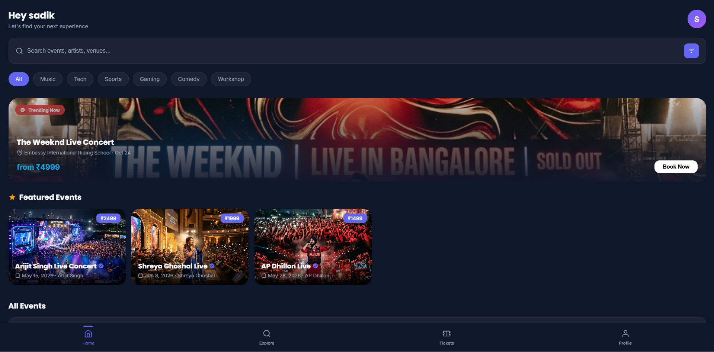
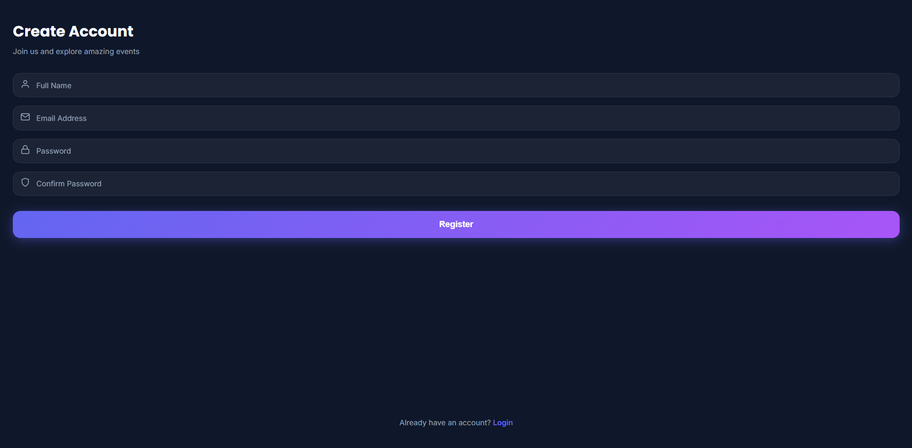
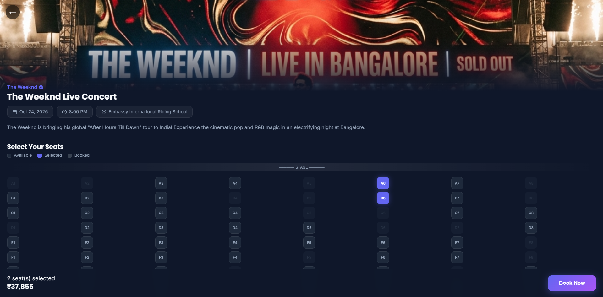

# SmartEvents

Welcome to the SmartEvents project repository. This is a full-stack platform built to make discovering, organizing, and managing events as straightforward as possible. We designed this to give users a seamless experience whether they are sitting at their computer or on the go.

## What's Inside

The project is split up into three main pieces to handle everything from the web interface to the database and mobile access:

- **Web Frontend (`/src`)**: A fast, responsive web app built using React and Vite.
- **Backend API (`/backend`)**: A Node.js server that handles our data, authentication, and core business logic.
- **Mobile App (`/mobile`)**: A companion application built with React Native (Expo) so users can manage their events directly from their phones.

## Getting Setup

Getting the project running locally is pretty simple. Before you start, just make sure you have Node.js installed on your machine.

### 1. Install Dependencies

Open up your terminal in the root folder of the project and install the main packages:

```bash
npm install
```

### 2. Start the Development Server

We have a handy script that fires up both the Vite web frontend and the Node backend at the same time. Just run:

```bash
npm run dev
```

Once that is running, your terminal will show you the local address where the web app is hosted (usually `http://localhost:5173`).

### 3. Running the Mobile App

If you want to work on the mobile application, you will need to head into its dedicated folder:

```bash
cd mobile
npm install
npm start
```

This will start the Expo bundler. From there, you can use the Expo Go app on your physical phone or an emulator to test out the mobile interface.

## Screenshots

### Home Page


### Login Page


### Booking Page

